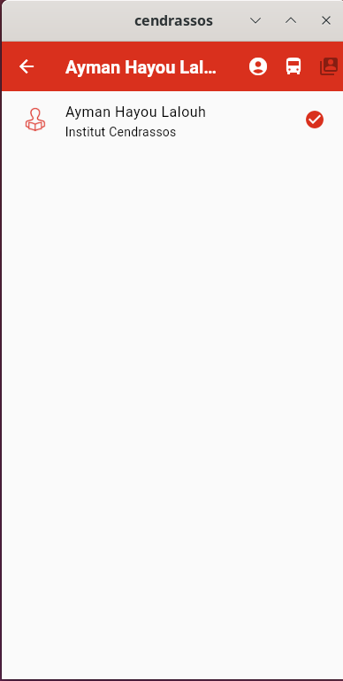
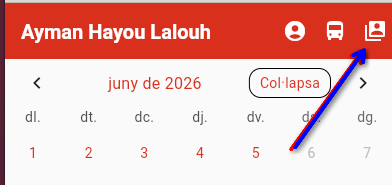
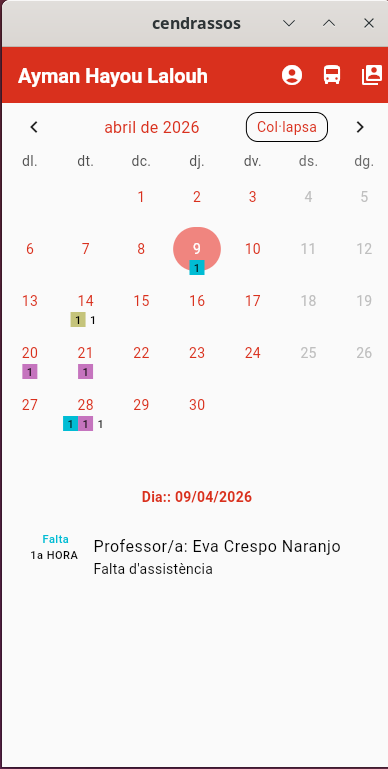
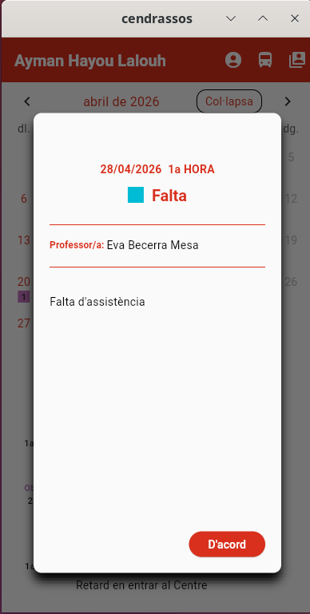
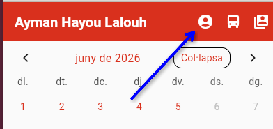
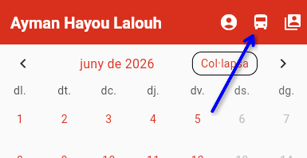
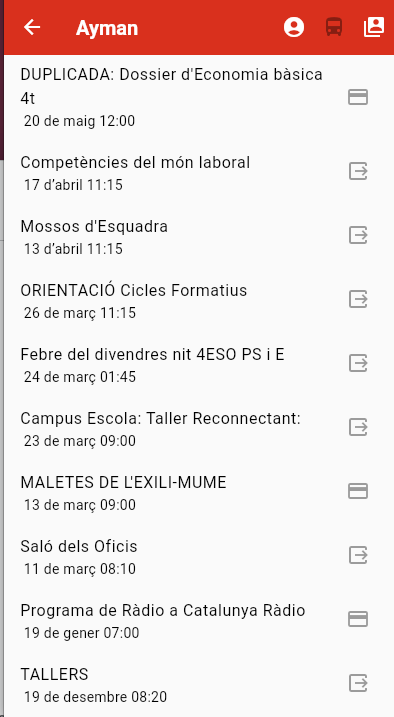
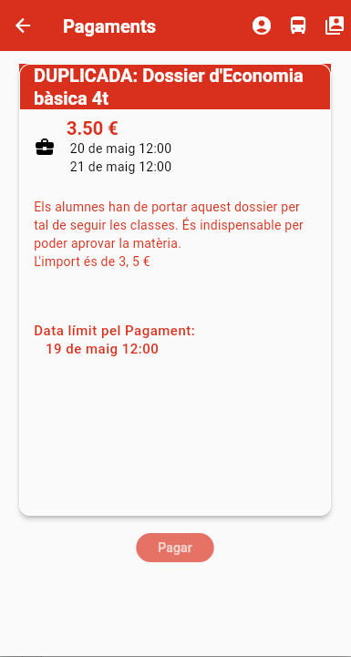

# Funcions de l'aplicació

## Afegir alumnes

Per incorporar un alumne nou a l'aplicació cal haver obtingut el codi QR que
proporcionarà el tutor.

La primera vegada que s'obre l'aplicació o si no hi ha cap alumne configurat, es dirigeix a la la pantalla d'obtenir credencials:

## Llista d'alumnes

L'aplicació recupera la llista d'alumnes del responsable i la llista en la pantalla de canvi d'alumnes

En cas que un responsable tingui més d'un alumne en el centre, aquesta pantalla també es fa servir per canviar d'un dels alumnes a un altre.

Sempre es pot accedir a aquesta pantalla des de la barra de menú superior

## Veure les notificacions

Des de qualsevol pantalla clicant sobre el nom de l'alumne que hi ha en la barra superior es va a la pantalla que  mostra el calendari amb anotacions als dies en que hi ha hagut una notificació

També s'hi pot accedir des de la pantalla de selecció d'alumnes clicant sobre el nom de l'alumne

Les notificacions es poden ampliar, si cal, clicant-hi a sobre

## Dades familiars

La pantalla de l'alumne es fa servir per comprovar si les dades dels alumnes que té el centre són correctes o no

La pantalla per comprovar les dades de l'alumne i el responsable sempre està disponible en el menú superior:

## Llistar i veure el detall de les sortides i pagaments

S'accedeix a la pantalla de pagaments i sortides a través de la icona de l'autobus

En la pantalla s'hi veuen les sortides i pagaments que s'han fet durant el curs.

En aquesta pantalla la icona defineix si la sortida és de pagament o no ho és:

| icona                   | Tipus                      |
| ----------------------- | -------------------------- |
|  | S'ha de realitzar pagament |
|  | Sortida o pagament gratuit |

Si la icona no és vermella és que el termini de pagament ha passat o que l'activitat ja s'ha produit.

> El pagament de les sortides encara no està disponible

Es pot veure més informació sobre l'activitat clicant-hi a sobre:

En els casos en que la sortida sigui de pagament el botó inferior permetrà fer el pagament a través de la passarela de pagaments.

## Avisos

El programa periòdicament comprova si hi ha notificacions en el servidor i
en cas d'haver-n'hi emet una notificació

